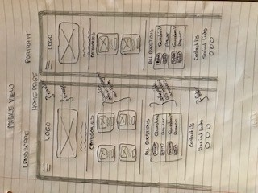
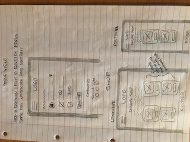
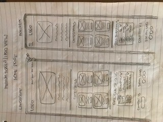

# Ultimate Irish Quiz

# Contents
1. <a href="#Demo">Demo</a>
1. <a href="#UX">UX</a>
    * <a href="#UserStories">User Stories</a>
    * <a href="#Strategy">Strategy</a>
    * <a href="#Wireframes">Wireframes</a>
1. <a href="#Features">Features</a>
    * <a href="#FeaturesLeft">Possible Future Features</a>
1. <a href="#Technologies">Technologies</a>
1. <a href="#Testing">Testing</a>
1. <a href="#Deployment">Deployment</a>
    * <a href="#GitHubPages">GitHub Pages</a>
    * <a href="#ProjectLocally">To run this project locally</a>
1. <a href="#Credits">Credits</a>
    * <a href="#Content">Content</a>
    * <a href="#Media">Media</a>
    * <a href="#Acknowledgements">Acknowledgements</a>
1. <a href="#Disclaimer">Disclaimer</a>

<h2>Third Milestone Project: Data Centric Development - Code Institute</h2>

This website is based on using MongoDB as a database to store questions 
and answers relating to Ireland which are categorised. I use CRUD operations - 
create questions, read questions, update questions and delete questions.

<h1 id="Demo">1. Demo</h1>

A live demo can be found <a target="_blank" href="https://ultimate-irish-quiz.herokuapp.com/">here.</a>

<h1 id="UX">2. UX</h1>
<h2 id="UserStories">User Stories</h1>

I myself have a keen interest in table quizes and during the lockdown, I held zoom quizzes with my friends 
in England and Ireland. After a few quizzes, I was running out of questions and found it a nuisance searching
loads of diffent quiz websites for questions. The one thing I noticed was that there wasn't a quiz website where
you could add and store questions and that's why I developed this website.

I also contacted 3 of my friends that have a keen interest in quizzes and all things Irish.

<h3>Damien and Julie from Kingsbury</h3>

As a user, we want to test our knowledge on all things Irish and don't want to see the answer 
before we have a guess and then be able to click to reveal the answer. We would like to be able 
to add questions that are not there already, delete questions that are incorrect and update 
questions that need updating.

<h3>John from Ballina</h3>

As a user, I want to get easy access to loads of Irish based questions and be able to view 
them by category.

<h3>Darren from Melbourne</h3>

As a user and quizmaster in local Irish Club, I want to be able to purchase specially 
designed quizzes based on Irish questions so that I don't have to waste time researching 
dozens of questions.

<h2 id="Strategy">Strategy</h2>

The overall strategy for visitors to this website is for them to read Irish questions and answers by category 
or all questions together, let them be able to update them, delete them and create them. My goal in the design of 
this website is to make it easy to navigate and use and easy on the eye.
As soon as you open the website you will see an image of Quiz Time in the Navbar which I find is eye catching.... 
I designed the logo on <a target="_blank" href="https://www.freelogodesign.org/">www.freelogodesign.org</a> and 
chose a subtle green, white and orange as these are the colours of Irish flag. I chose the image of the head with emphasise 
of the brain showing brainpower to answer questions. 
I used <a target="_blank" href="https://materializecss.com/color.html/"> materialize colours</a>
and selected mainly different shades of green and orange for the basis of the website pages as these are the colours of the Irish flag.
I selected these colours consistently throughout the website so as not to overpower the website with too many colours.
I have used <a target="_blank" href="https://fonts.google.com/">Google Fonts</a> to select the 2 different fonts used 
in the website. I chose Montserrat font for the 
main headings as it compliments the Logo font. I also chose Roboto font for the main scripting as it is a good pairing
with Montserrat font as per the google font website.

<h2 id="Wireframes">Wireframes</h2>

<h3>Wireframes for mobile devices</h3> 

<h3>Wireframes for tablet devices</h3> 

<h3>Wireframe for desktop devices</h3> 

<h1 id="Features">3. Features</h1>
<h2>Navbar</h2>
I have used a responsive navigation bar using materialize.  
For mobile devices a hamburger menu on the top-left expands a menu with links to 
the different sections and pages on the website with the logo in the centre. On larger 
devices the expanded menu is shown instead. I feel this will be easy for users to 
quickly navigate the website. This navbar will be fixed for easy navigation.

<h2>Card</h2>
I used the <a target="_blank" href="https://materializecss.com/cards.html">Materialize Cards</a> 
for the Chose Category section as I could show an image , a wee write up and a link all in the one card.
I also used it for the purchase quizzes section in the shop page. Again, I could show an image, a more 
detailed section for each quiz when you click <i class="material-icons">more_vert</i> and a link to purchase
the quiz. When you hover over the cards, a subtle shadow affect will appear.

<h2>Modal</h2>
For the Contact Us Form section in the Footer, I chose to use a modal as it would 
take up too much space in the footer. 

<h2>Contact Form and EmailJS</h2>
I included a contact form with 3 required fields (name, email and query) 
that when completed correctly will send an email to myself and an auto reply email
to the sender using <a target="_blank" href="https://www.emailjs.com/">EmailJS</a>. 
If one or more of the fields are not completed correctly, website visitor will be advised and
will not be able to send until all fields completed.

<h2>Buttons</h2>
When you hover over all buttons, it will change to a subtly darker shade of the exiting colour 
with a shadow behind the button.

<h2 id="FeaturesLeft">Possible Future Features</h2>
* Possibly add a Log In/Sign Up option. Allow members only allowed to Add, Edit or Delete questions. 
* Add a chat function for the members to communicate to each other.
* When Delete is pressed, add a modal to let the user confirm they want to delete the question.
* Add a flash message when submit button is pressed in the contact us form to advise that it was
completed (as well as receiving a confirmation email - already in place).
* Complete the add to cart link (have not learned yet - under construction in this website)

<h1 id="Technologies">4. Technologies</h1>
<h2>Language Used</h2>

* <a target="_blank" href="https://en.wikipedia.org/wiki/HTML">HTML</a>
* <a target="_blank" href="https://en.wikipedia.org/wiki/Cascading_Style_Sheets">CSS</a>
* <a target="_blank" href="https://en.wikipedia.org/wiki/JavaScript">Javascript</a>
* <a target="_blank" href="https://www.python.org/">Python</a>

<h2>Frameworks, Libraries & Programs Used</h2>

* <a target="_blank" href="https://materializecss.com/">Materialize</a>
    * **Materialize** was used to assist with the responsiveness and styling of the navbar, 
    the sidebar, the cards, icons on forms, the colours, the shadows, the buttons, the modal 
    and the footer.
* <a target="_blank" href="https://fonts.google.com/">Google Fonts</a>
    * **Google fonts** were used to import the Montserrat and Roboto font into the style.css 
    file which are the 2 fonts used in the project.
* <a target="_blank" href="https://fontawesome.com/">Font Awesome</a>
    * **Font Awesome** was used to add icons for UX purposes. Icons specifically used for social 
    icons in footer.
* <a target="_blank" href="https://jquery.com/">jQuery</a>
    * The project uses **JQuery** to simplify DOM manipulation.
* <a target="_blank" href="https://www.emailjs.com/">EmailJS</a>
    * When the Contact Us form is completed correctly, **EmailJS** will email myself details of 
    the completed contact form and also auto reply to the user.
* <a target="_blank" href="https://git-scm.com/">Git</a>
    * **Git** was used for version control by utilizing the Gitpod terminal to commit to Git and Push to GitHub and Heroku.
* <a target="_blank" href="https://www.gitpod.io/">Gitpod</a>
    * **Gitpod** was the primary IDE used throughout the entirety of the project.
* <a target="_blank" href="https://github.com/">GitHub</a>
    * **GitHub** is used to store the project code after being pushed from Git.
* <a target="_blank" href="https://htmlformatter.com/">HTML Formatter</a>
    * **HTML Formatter** was used to beautify code to keep the code neat and 
    easy to read. It was utilised as Beautify Cmd (Shift + Alt + F) in GitPod distorted the code in GitHub.
* <a target="_blank" href="https://dashboard.heroku.com/">Heroku</a>
    * **Heroku** is a platform as a service (PaaS) that enables 
    developers to build, run, and operate applications entirely in the cloud. 
    This website is deployed using Heroku.
* <a target="_blank" href="https://flask.palletsprojects.com/en/1.1.x/">Flask</a>
    * **Flask** is used to dynamically generate pages and content within the application.    
* <a target="_blank" href="https://pypi.org/project/pymongo//">PyMongo</a>
    * **PyMongo**  is used connect and interact with my data to and from my MongoDB database.
* <a target="_blank" href="https://en.wikipedia.org/wiki/Jinja_(template_engine)">Jinja</a>
    * **Jinja** is used as the template engine for python.
* <a target="_blank" href="https://www.mongodb.com/cloud/atlas">MongoDB</a>
    * **MongoDB** is used as my storage database for category name, questions and answers, eg
        * _id 5ede8f190d65a7821001c3a0 
category_name: "General Knowledge" 
question: "Who opened its first store in Ireland first - Aldi or Lidl?" 
answer: "Aldi"

<h1 id="Testing">5. Testing</h1>

### UX Stories
**Damien and Julie from Kingsbury** wanted the following: 
Collapsible question and answer - included 
CRUD - included
 
**John from Ballina** wanted the following: 
View questions by category - included

**Darren from melbourne** wanted the following: 
Online shop to purchase ready made quizzes (wip) - included

### Validation
I used validator websites to test the following:

* **HTML** - <a target="_blank" href="https://validator.w3.org/">W3C Html Checker</a> - all errors in all html pages relate to { is not allowed in certain lines which relates to jinja.
* **JavaScript** - <a target="_blank" href="https://jshint.com/">JSHint</a>  - zero warnings
* **Python**  - <a target="_blank" href="http://pep8online.com/">PEP8 Online Check</a> - a number of whitespace and lines too long warnings. Line 26 line too long (83 > 79 characters). Could not indent it any less or move it to next line.

* **CSS** - <a target="_blank" href="https://jigsaw.w3.org/css-validator/#validate_by_input">W3C CSS Checker</a> - No errors found

 

    

When I right clicked inspect, zero error or warnings appeared.

### Responsiveness

I tested the responsiveness of the website on google chrome by using <a target="_blank" href="http://www.responsinator.com/">www.responsinator.com</a>. I also used the 
the inspect by right clicking over the website and then going into the toggle device toolbar. I selected the most used devices to also test for 
responsiveness i.e. iPhone 6/7/8, iPhone 6/7/8 plus, iPhone X, iPad and iPad Pro.

### Navbar
All links in navabar in all pages are tested and working correctly. 

### Sidebar
All links in sidebar in all pages are tested and work correctly, however when in home page, the links to Categories and All Questions
go to the correct section however the sidebar remains. You have to click outside sidebar to make it disappear.
I've googled problem, asked help from tutor support but no joy to fix the problem.

### Footer
All links in footer in all pages are tested and working correctly

### Links in main section of Pages
**Home Page** 

* Shop links tested and working correctly
* All links in category cards tested and working correctly bringing you to the list of questions 
* All links for Edit, Delete and reveal answer are tested and working correctly 
  
**Add a Question Page**

* Dropdown for category is tested and working correctly
* Question and answer fields are tested and working correctly
* Link to add question is tested and working correctly
* If question, answer or both fields are left blank, question will not be added is tested and working correctly 

**Edit a Question Page**

* Dropdown for category is tested and working correctly
* Question and answer fields are tested and working correctly
* Link to edit question is tested and working correctly
* If question, answer or both fields are left blank, question will not be added is tested and working correctly

**Categories Page**

* All links for Edit, Delete and reveal answer are tested and working correctly

**Shop Page**

* All links in Quiz purchase cards are tested and working correctly 

**Shop Page**

* Link back to Home page and shop page are tested and working correctly

### Contact Us
Contact Us working correctly. I tried to submit an empty form and verified that an error message about the 
required fields appears. Tried to submit the form with an invalid email address without an @ and verified 
that a relevant error message appears. Tried to submit the form with only 1 field correctly entered, then 
2 fields correctly and verified that a relevant error message appears
for the remaining field(s) left blank.

### EmailJS
When form fully completed correctly, I have checked that an email will be sent to my email address with all information
given and also an automatic email will be sent the the email address entered in the form to say "Hi 'fname' Thank you
for completing the contact form in the Ultimate Irish Quiz website. We will reply to you within 24 hours. 
Kinds Regards, Ultimate Irish Quiz."

### Browser Compatibility
. | Appearance | Responsiveness | Comments |
------------ | ------------- | ------------ | ------------
Chrome  |Good        | Good | n/a
Firefox |Good        | Good | n/a       
Safari  |Good        | Good | n/a      
Miscosoft Edge   |Good        | Good | n/a    

     

<h1 id="Deployment">6. Deployment</h1>
<h2 id="GitHubPages">GitHub Pages</h2>

Ultimate Irish Quiz was developed using the Gitpod IDE. A repository was created on GitHub and regular commited 
to Git and pushed to GitHub and Heroku and was deployed using Heroku. 

 In order to deploy to Heroku, I did the following:

1. I logged into Heroku, selected "create new app", named it "ultimate-irish-quiz" and set region to Europe 
1. In settings, I selected configuration vars and created PORT (5000) and IP(0.0.0.0) and pressed add.
1. I added “MONGO_URI” with the secret key.
1. I then created a GitHub repository ultimate-irish-quiz and opened it in Gitpod. 
1. I created a requirements.txt file using $ pip3 freeze --local > requirements.txt
1. I created a Procfile, opened it and add: web: python app.py
1. I then did git add requirements.txt, git add Procfile and commited them.
1. I then logged into heroku using heroku login and clicked login
1. I added a remote repo to git repo using heroku git:remote -a ultimate-irish-quiz
1. I pushed git repo to heroku using git push heroku master
1. And the deployed website can be found at https://ultimate-irish-quiz.herokuapp.com/ 

<h1 id="Credits">7. Credits</h1>

<h2 id="Content">Content</h2>

All content in this website was written by myself.

<h2 id="Media">Media</h2>

The images were taken from the internet. (website are for educational purposes only.) 

<h2 id="Acknowledgements">Acknowledgements</h2>
The main websites I used to help me with the coding in the various sections are:

1. <a target="_blank" href="https://www.w3schools.com">W3School Website</a>
2. <a target="_blank" href="https://stackoverflow.com/">stackoverflow Website</a>

I would like to ackknowledge the Code Institute Learning Management System on helping 
me learn all about HTML, CSS, Javascript, Python and MongoDB. The mini projects were a great help. 
I would also like to thank the team in Tutor Support and my mentor for some problems I encountered along the way.

<h1 id="Disclaimer">8. Disclaimer</h1>
The content and images on this website are for educational purposes only.